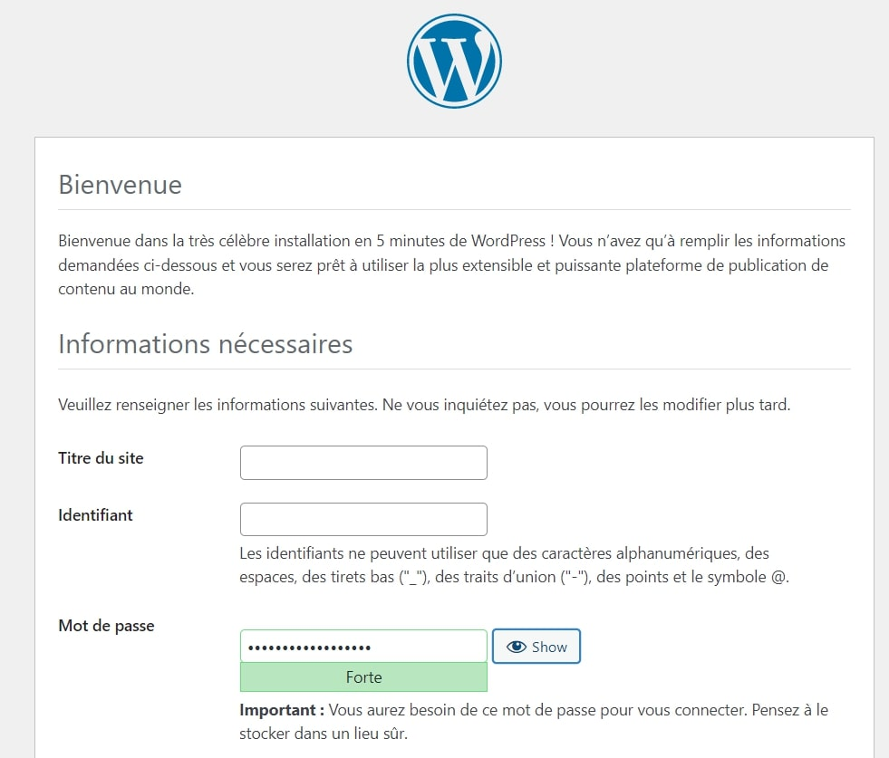
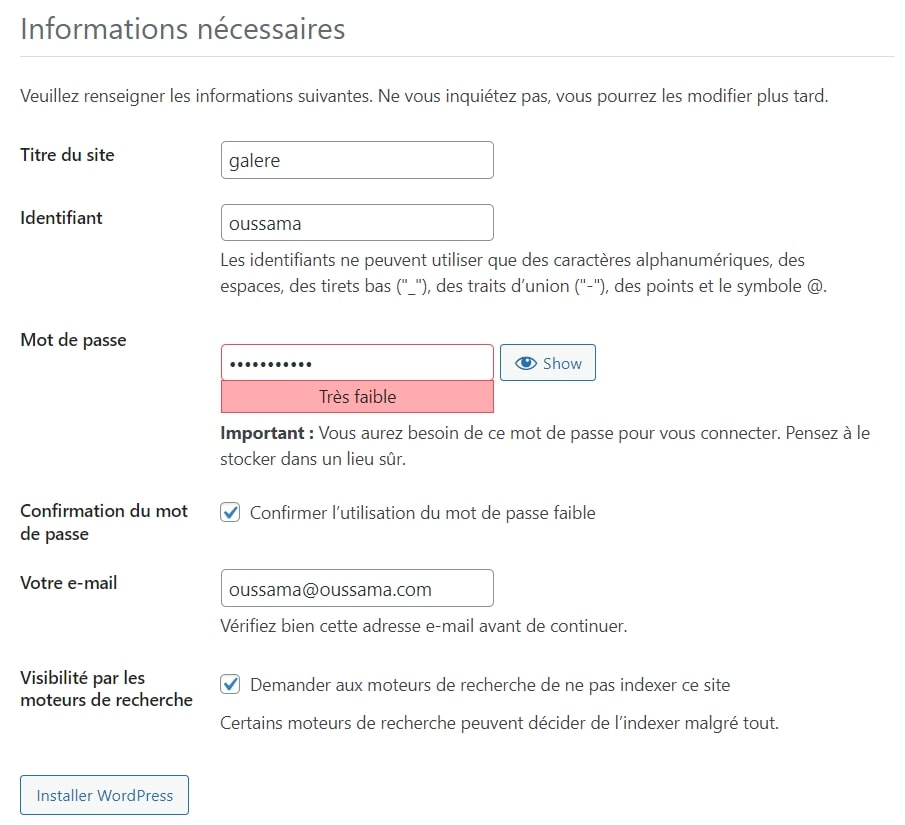
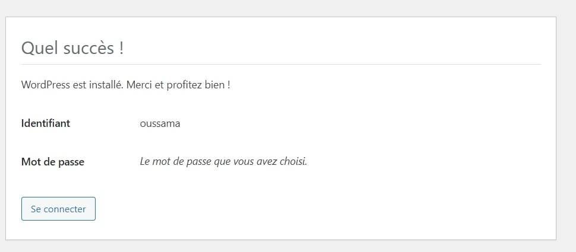
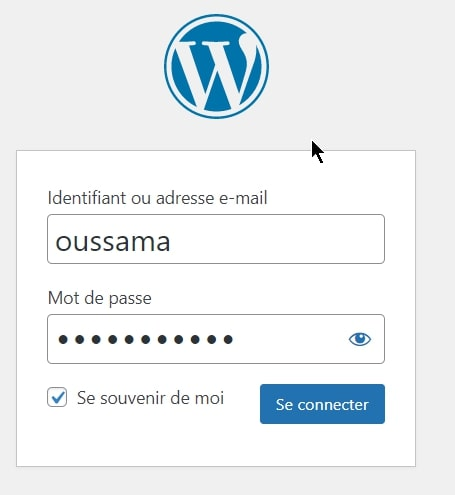
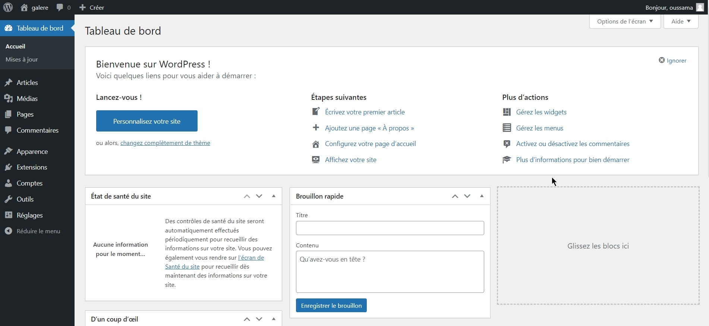

# kubernetesProjet
## Déployez Wordpress à l’aide de manifests

_Déployez wordpress à l’aide des étapes suivantes:_
```doc
• Créez un deployment mysql avec un seul réplica.
• Créez un service de type clusterIP pour exposer votre pod mysql.
• Créez un deployment wordpress avec les bonnes variables d’environnement pour se connecter à la base de données mysql.
• Votre deployment devra stocker les données de wordpress et de mysql sur un volume mounté dans le (wordpress : /data) et (mysql : /db-data) de votre nœud.
• Créez un service de type nodeport pour exposer le frontend wordpress.
• Utiliser les manifests pour réaliser cet Projet
```

## Etape 1
### Créez un service de type clusterIP
```yaml
apiVersion: v1
kind: Service
metadata:
  name: service-clusterip
spec:
# pas d’accès externe, pour les pods à l’intérieur du même cluster
  type: ClusterIP
  # cible  n'importe quel pod avec l'étiquette «app=mysql-deploy»
  selector:
    app: mysql-deploy
  ports:
    - protocol: TCP
    #Le port MySQL par défaut est 3306
      port: 3306
      targetPort: 3306
```

### Ajouter un gobjet secret

Un secret est un objet qui stocke une donnée sensible comme un mot de passe ou une clé. La variable d'environnement MYSQL_ROOT_PASSWORD définit le mot de passe de la base de données à partir de "mysql-secret".

Note :
```txt
 Normalement, un fichier de type "secret.yaml" avec les informations suivantes devrait être créé afin de séparer les données sensibles. toutefois, dans un souci de lisibilité j'ai décidé d'ajouter le "kind: Secret" directement dans mon fichier "deployment-mysql.yml"
```
```yaml
apiVersion: v1
kind: Secret
metadata:
  name: mysql-secret
type: Opaque
stringData:
  password: formation68
```

### Stocker les données de mysql sur un volume mounté dans /db-data

MySQL nécessitent chacun un PersistentVolume pour stocker les données. Le conteneur MySQL monte le PersistentVolume dans /var/lib/mysql. 

```yaml
volumeMounts:
        - name: mysql-data
          mountPath: /var/lib/mysql
      volumes:
      - name: mysql-data
        hostPath:
            path: /db-data
            type: DirectoryOrCreate
```


* Créez un deployment mysql avec un seul réplica.

=>vi deployment-mysql.yml

```yaml
apiVersion: v1
kind: Secret
metadata:
  name: mysql-secret
type: Opaque
stringData:
  password: formation68
---

apiVersion: v1
kind: Service
metadata:
  name: service-clusterip
spec:
  type: ClusterIP
  selector:
    app: mysql-deploy
  ports:
    - protocol: TCP
      port: 3306
      targetPort: 3306

---
apiVersion: apps/v1
kind: Deployment
metadata:
  name: deployment-mysql
  labels:
    app: wordpress
spec:
  replicas: 1
  selector:
    matchLabels:
      app: mysql-deploy
  template:
    metadata:
      labels:
        app: mysql-deploy
    spec:
      containers:
      - name: mysql
        image: mysql
        env:
        - name: MYSQL_DATABASE
          value: wordpress
        - name: MYSQL_PASSWORD
          value: formation68
        - name: MYSQL_ROOT_PASSWORD
          valueFrom:
             secretKeyRef:
                name: mysql-secret
                key: password
        ports:
        - containerPort: 3306
        volumeMounts:
        - name: mysql-data
          mountPath: /var/lib/mysql
      volumes:
      - name: mysql-data
        hostPath:
            path: /db-data
            type: DirectoryOrCreate
```

=>  kubectl apply -f deployment-mysql.yml
```bash
secret/mysql-secret created
service/service-clusterip created
deployment.apps/deployment-mysql created
```
=> kubectl get deployments.apps
```bash
NAME               READY   UP-TO-DATE   AVAILABLE   AGE
deployment-mysql   1/1     1            1           108s
```

=> kubectl describe deployments.apps deployment-mysql
```bash
Name:                   deployment-mysql
Namespace:              default
CreationTimestamp:      Tue, 21 Dec 2021 13:21:28 +0000
Labels:                 app=wordpress
Annotations:            deployment.kubernetes.io/revision: 1
Selector:               app=mysql-deploy
Replicas:               1 desired | 1 updated | 1 total | 1 available | 0 unavailable
StrategyType:           RollingUpdate
MinReadySeconds:        0
RollingUpdateStrategy:  25% max unavailable, 25% max surge
Pod Template:
  Labels:  app=mysql-deploy
  Containers:
   mysql:
    Image:      mysql
    Port:       3306/TCP
    Host Port:  0/TCP
    Environment:
      MYSQL_DATABASE:       wordpress
      MYSQL_PASSWORD:       formation68
      MYSQL_ROOT_PASSWORD:  <set to the key 'password' in secret 'mysql-secret'>  Optional: false
    Mounts:
      /var/lib/mysql from mysql-data (rw)
  Volumes:
   mysql-data:
    Type:          HostPath (bare host directory volume)
    Path:          /db-data
    HostPathType:  DirectoryOrCreate
```

## Etape 2

Créez un deployment wordpress avec les variables d’environnement pour se connecter à la base de données mysql.

### Créez un service de type nodeport pour exposer le frontend wordpress

```yaml
apiVersion: v1
kind: Service
metadata:
  name: wordpress
spec:
  type: NodePort
  selector:
    app: wordpress
  ports:
    - protocol: TCP
      port: 80
      targetPort: 80
      nodePort: 30001
```

### Stocker les données de wordpress sur un volume mounté dans /data

Wordpress nécessitent chacun un PersistentVolume pour stocker les données. Le conteneur wordpress monte le PersistentVolume dans /var/www/html. 

```yaml
 name: wordpress
        volumeMounts:
        - name: data
          mountPath: /var/www/html
      volumes:
      - name: /data
```

### WORDPRESS_DB_HOST

```yaml
apiVersion: v1
kind: Service
metadata:
  name: service-clusterip
spec:
  type: ClusterIP
  selector:
    app: mysql-deploy
  ports:
    - protocol: TCP
      port: 3306
      targetPort: 3306
```
La variable d'environnement WORDPRESS_DB_HOST définit le nom du service "service-clusterip" qui sera utilisé depuis MySQL que j'ai défini lors du deploiement de MySQL. WordPress accédera à la base de données par ce service.

## Créez un deployment wordpress 
=>vi deployment-wordpress.yml

```yaml
apiVersion: v1
kind: Service
metadata:
  name: wordpress
spec:
  type: NodePort
  selector:
    app: wordpress
  ports:
    - protocol: TCP
      port: 80
      targetPort: 80
      nodePort: 30001
      
---

apiVersion: apps/v1
kind: Deployment
metadata:
  name: wordpress
  labels:
    app: wordpress-deployment
spec:
 replicas: 1
 selector:
    matchLabels:
      app: wordpress
 template:
    metadata:
      labels:
        app: wordpress
    spec:
      containers:
      - image: wordpress
        name: wordpress
        env:
        - name: WORDPRESS_DB_HOST
          value: service-clusterip
        - name: WORDPRESS_DB_PASSWORD
          valueFrom:
            secretKeyRef:
              name: mysql-secret
              key: password
        - name: WORDPRESS_DB_USER
          value: root
        - name: WORDPRESS_DB_NAME
          value: wordpress
        ports:
        - containerPort: 80
          name: wordpress
        volumeMounts:
        - name: data
          mountPath: /var/www/html
      volumes:
      - name: data
        hostPath:
            path: /data
            type: DirectoryOrCreate
```

=>  kubectl apply -f deployment-wordpress.yml
```bash
service/wordpress created
deployment.apps/wordpress created
```

=> kubectl get deployments.apps wordpress
```bash
NAME        READY   UP-TO-DATE   AVAILABLE   AGE
wordpress   1/1     1            1           2m50s
```

=> kubectl describe deployments.apps wordpress
```bash
Name:                   wordpress
CreationTimestamp:      Tue, 21 Dec 2021 13:39:36 +0000
Labels:                 app=wordpress-deployment
Pod Template:
  Labels:  app=wordpress
  Containers:
   wordpress:
    Image:      wordpress
    Port:       80/TCP
    Environment:
      WORDPRESS_DB_HOST:      service-clusterip
      WORDPRESS_DB_PASSWORD:  <set to the key 'password' in secret 'mysql-secret'>  Optional: false
      WORDPRESS_DB_USER:      root
      WORDPRESS_DB_NAME:      wordpress
    Mounts:
      /var/www/html from data (rw)
```

## Les tests de validation

=> kubectl get pod
```bash
NAME                                READY   STATUS    RESTARTS   AGE
deployment-mysql-7999b96c5b-sxjc9   1/1     Running   0          48m
wordpress-7dbfdd6d7b-xf25r          1/1     Running   0          29m
```

ubuntu@minikube-master:~$ => kubectl describe pod deployment-mysql-7999b96c5b-sxjc9

```bash
 Mounts:
      /var/lib/mysql from mysql-data (rw)
      /var/run/secrets/kubernetes.io/serviceaccount from kube-api-access-5ddm5 (ro)
Volumes:
  mysql-data:
    Type:          HostPath (bare host directory volume)
    Path:          /db-data
    HostPathType:  DirectoryOrCreate
```

ubuntu@minikube-master:~$ => kubectl describe pod wordpress-55858c5bd7-6nfpj
```bash
 Environment:
      WORDPRESS_DB_HOST:      service-clusterip
      WORDPRESS_DB_PASSWORD:  <set to the key 'password' in secret 'mysql-secret'>  Optional: false
      WORDPRESS_DB_USER:      root
      WORDPRESS_DB_NAME:      wordpress
    Mounts:
      /var/run/secrets/kubernetes.io/serviceaccount from kube-api-access-8rcvl (ro)
      /var/www/html from data (rw)
```


## J'accède à l'interface graphique de Wordpress
http://107.22.129.170:30001/

### Aperçu en image de la premiere identification










http://107.22.129.170:30001/wp-admin/



ubuntu@minikube-master:~$ => ls -la /
```bash
drwxr-xr-x   5 www-data         www-data  4096 Dec 21 14:26 data
drwxr-xr-x   7 systemd-coredump root      4096 Dec 21 13:21 db-data
```

ubuntu@minikube-master:~$ ls -la /data
```bash
total 244
-rw-r--r--  1 www-data www-data   405 Feb  6  2020 index.php
-rw-r--r--  1 www-data www-data 19915 Jan  1  2021 license.txt
-rw-r--r--  1 www-data www-data  7346 Jul  6 12:23 readme.html
```

ubuntu@minikube-master:~$ => ls -la /db-data
```bash
drwxr-xr-x  7 systemd-coredump root                 4096 Dec 21 13:21  .
drwxr-xr-x 23 root             root                 4096 Dec 21 13:21  ..
drwxr-x---  2 systemd-coredump systemd-coredump     4096 Dec 21 13:21  mysql
-rw-r-----  1 systemd-coredump systemd-coredump 31457280 Dec 21 13:56  mysql.ibd
drwxr-x---  2 systemd-coredump systemd-coredump     4096 Dec 21 13:53  wordpress
```
